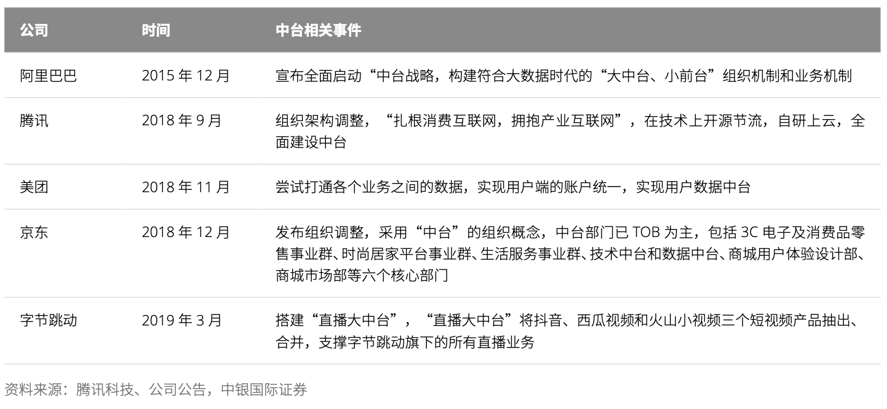

# 1.1 `中台`概念的提出、流行到深水区实践，折射出本轮`数字化转型`中以业务`平台化`为代表的企业现代化趋势

## 1）以互联网巨头`中台化`为原点，延伸到以零售、金融、电信为代表的传统行业`数字化建设`，`中台`实践正在进入到深水区

从 2015 年开始，以阿里巴巴为代表的各互联网巨头，陆续开启`中台化`进程（如图 1）。随后，`中台`理念和相关实践开始快速向各行业渗透和发展。

(图 1.1-1 互联网企业的中台化大事件)(参考文献 3)

### 零售行业 

得益于阿里在零售行业的渗透和影响，以及电商在过去十年的高速发展，零售行业最先试水`中台`。

一方面，阿里本身将`中台`理念与实践结合云服务向各行业输出，同时零售行业因业务模式的相似性，也具备较好的适配基础。

另一方面，围绕电商业务模式，一系列厂商将其中标准化程度较高的部分快速“中心化”，如“商品中心”，“订单中心”，“支付中心”等，以`中台`的形态进行实施，也在一定程度上促进了`中台`在零售行业的推广。

而零售行业的`中台`模型，因其本质是对于交易合同及履约的业务抽象，具备较广的适用性，也常被其他行业借鉴和扩展。

### 金融行业

对于金融行业，打造`中台`能力，无论在银行、证券或是保险等细分行业，均已是高度共识的战略举措之一。（参考文献 4、5）

当行业越来越重视客户一致性体验，开始打造开放银行，深度运营客户，构建生态的同时，对于长期掣肘金融行业发展的历史遗留问题，企业也深刻意识到对于此类问题解决的迫切性。如庞大的遗留系统难以响应前端快速的业务创新、客户和业务数据孤岛现象严重、组织架构壁垒高筑等。

而`中台`建设被认为是行业普遍认同的求解之道，根据恒生调研，半数金融机构正在考虑建设业务`中台`，90% 金融机构认为未来两至三年会建设业务`中台`。（参考文献 4、5）

### 电信行业

以 IT 基础设施作为重要支柱的电信行业，始终保持对 IT 新技术与工程实践的关注和引入。过去 5 年，伴随通信技术的快速换代所带来的新的市场特征，围绕业务响应力提升和研发效能改进的目标，电信行业 IT 基础设施经历了新一轮的翻新和升级：

* 研发体系的`敏捷`转型，
* `DevOps` 体系搭建、
* 大型核心系统的`容器化`及`服务化`改造。

在此基础上，加之“新基建”顶层设计的牵引和推动，行业整体的 IT 基础设施进一步深化，`中台`建设作为突破点和抓手之一，在营销、服务、网运等多层面展开，并不断取得进展。

## 2）ThoughtWorks 在以上行业`中台`建设的深入实践认为，`中台`不是目的，而是手段，`平台化`向业务的再演进，是本轮`数字化建设`中的重要趋势

回顾 ThoughtWorks 对于`中台`的实践，我们持续向行业输出一系列思考和洞见的同时，也广泛且深入参与了各行业的`数字化建设`中、尤其是以上三大行业中领跑企业的`中台`建设过程。

在我们的经验中，不同的行业，`中台`有着不同的最佳适配领域，这里从前面提到的三大行业中，我们列举一些各自领域关注的方向：

 * 零售多品牌集团型企业： 关注如何通过`中台`建设，实现集中管控前提下营销能力在多品牌复用
 * 跨国零售企业：
 关注如何通过`中台`建设，实现全球统一运营下的核心业务能力针对中国市场的复用与差异化适配，以适应中国的特有业务场景和业务发展
 * 商业银行与金融机构：
 关注在特定业务（如信贷、资管）场景的能力抽取与模式复用，实现对于金融产品的快速创新的加速，和金融电商化的渠道能力运营的加强，为生态建设奠定基础
 * 通信企业：
 关注如何实现跨业务线之间的公共能力的识别，沉淀，形成统一管控及支撑，实现产品`平台化`，更灵活的适配不同场景的需求与快速响应。

这些领域中，`中台`的差异化适配和建设，印证了`中台`实践已进入深水区。而与此同时，`中台`实施“失败”的案例也不绝于耳，行业对`中台`观点，出现清晰的分化。

这里，我们不展开对于`中台`实施失败案例的讨论与分析，而将关注点放在更加底层的商业逻辑和方法论沉淀上来。

## 本质逻辑

在我们看来，`中台`建设的成功，或者“失败”，甚至`去中台化`声音背后，本质上是一致的商业逻辑：

### `中台建设`“不是”广义软件套件实施：

`中台`以“复用”之名起源，因此，一些案例中，很容易走回从前软件套件实施的思路，以“套件化”的模式，加上一定程度的开放和定制，实现“复制”。

“复制”、“复用”一字之差，却意味着从规划到落地截然不同的方法和实现。

由此带来的问题是，曾经套件化实施过程中围绕“削足适履”出现过的问题、走过的弯路，在`中台`规划与建设中，如果仍以`中台`“产品套件”实施方式，会不可避免的再次出现。

### `中台`建设“是”对于企业业务模式端到端的深度分析、建模与复用：

`中台`究竟在复用什么？

我们给出的答案是：`中台`是针对于“商业模式”和“业务模式”的抽象与复用。

背后体现的是企业希望通过对于自身商业模式的不断思考与认知，再通过自身业务模式的抽象与沉淀，实现跨地域、跨用户、跨场景、跨领域的扩展与复用，支撑企业业务的快速拓展与创新，也体现和契合了平台向业务的再演进过程。

借用我们一位咨询师的话：

 > “看上去的能力复用是乐高组装，但真实的能力复用其实是器官移植，需要的是一场外科手术。”

因此，我们认同这样的观点：

  > `中台`是手段、过程，不是目的本身。
  > 
  > 回归本源，从问题与价值出发，`平台化`向业务的再演进，是这一轮`数字化建设`浪潮中需要关注的重要趋势，也是企业现代化进程中的关键步骤。

